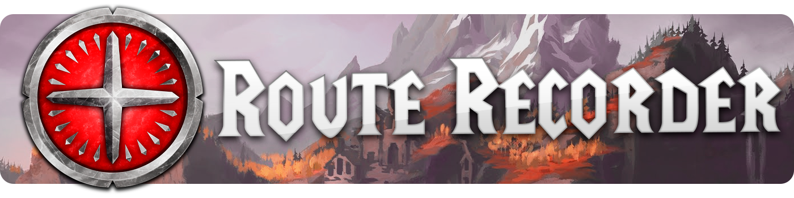
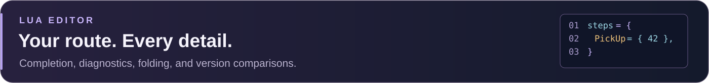

  

<h1 align="center">Record your journey. Create your route.</h1>

  A route-building companion for <strong>Azeroth Pilot Reloaded</strong>. 
  Capture your adventures, refine every step, and share your routes with the community.

  

  
  
  

  <a href="#getting-started"><strong>Get started</strong></a> &nbsp;·&nbsp;
  <a href="#user-friendly-ui"><strong>Visual workshop</strong></a> &nbsp;·&nbsp;
  <a href="#lua-editor"><strong>Lua editor</strong></a> &nbsp;·&nbsp;
  <a href="#automatic-recording"><strong>Automatic recording</strong></a> 
  <a href="#manual-actions-options-and-conditions">Actions &amp; conditions</a> &nbsp;·&nbsp;
  <a href="#utility-commands">Commands</a> &nbsp;·&nbsp;
  <a href="#settings-and-support">Settings &amp; support</a> &nbsp;·&nbsp;
  <a href="#credits">Credits</a>

  <picture>
    <source media="(max-width: 600px)" srcset="docs/assets/readme/workflow-mobile.svg">
    
  </picture>

---

  

## Getting started

<table>
  <tr>
    <td width="50%" valign="top">
      <h3>01 &nbsp; Open the workshop</h3>
      
Click the recorder button or type <code>/aprrc</code>.

    </td>
    <td width="50%" valign="top">
      <h3>02 &nbsp; Capture your route</h3>
      
Choose <strong>New route</strong>, name it, then click <strong>Record this route</strong>. Select an existing route to resume recording.

    </td>
  </tr>
  <tr>
    <td width="50%" valign="top">
      <h3>03 &nbsp; Make it your own</h3>
      
Stop recording and review your steps in the <strong>visual inspector</strong> or the <strong>Lua editor</strong>.

    </td>
    <td width="50%" valign="top">
      <h3>04 &nbsp; Save and play</h3>
      
Click <strong>Save</strong> or press <kbd>Ctrl</kbd> + <kbd>S</kbd>. Saved routes appear automatically in APR's <strong>Custom</strong> tab, including after login or UI reload.

    </td>
  </tr>
</table>

> [!TIP]
> **Start from a route you already know.** Use **Import from APR** to search loaded routes by name or route key and create an editable copy. Editor changes stay in a draft until saved; recording updates the recorded route independently.

For APR field syntax and playback behavior, see the [APR Route Syntax wiki](https://github.com/Azeroth-Pilot-Reloaded/azeroth-pilot-reloaded/wiki/APR-Route-Syntax). The tables below describe the fields supported by this recorder.

---

  <picture>
    <source media="(max-width: 600px)" srcset="docs/assets/readme/visual-workshop-mobile.svg">
    
  </picture>

## User-friendly UI

The workshop lets you build and review routes without writing Lua. Select a step in the numbered list, then edit its actions, coordinates, and conditions in the inspector. Search and filters help you find steps in long routes; hover an icon to see its action and shortcut.

| Tab or control | What you can do |
| --- | --- |
| Route selector and recording controls | Create, select, or resume a route; start and stop recording. |
| **Route** | Edit the label, map, expansion, category, game version, route conditions, dependencies, next routes, presets, and scenarios. |
| **Steps** | Add, duplicate, move, delete, and edit main-route steps. Use **Previous step** and **Next step** in the inspector to move through the filtered list. |
| **Parallel steps** | Create, duplicate, reorder, or delete groups. Edit group conditions and their steps with the same controls as the main route. |
| **Lua editor** | Edit the complete route definition, including metadata and parallel steps. See [Lua editor](#lua-editor) below. |
| **Versions** | Compare saved, draft, and archived versions; merge changes, rebase a draft, or recover a version into a separate copy. Up to 40 distinct versions are kept per route. |
| **Commands** | Search recording actions and options, launch them, and customize command-bar favorites, order, labels, orientation, and size. |
| **Tools** | Open coordinates, extra-line-text tools, recording actions, and addon settings. |
| **Compact mode** / **Full width** | Switch between a single-pane layout and the full list/inspector layout. Window size and layout are remembered. |
| **Follow recording** | Follow the newest captured step. Interaction pauses following for five seconds; focused inputs, dialogs, and pending edits keep it paused. |
| **Follow APR** | Follow the current APR playback step, including parallel steps. When both follow modes apply to the same route, APR playback takes priority. |

Forms include searchable quest, spell, and item selectors; class/race checkboxes; objective rows; and gold/silver/copper inputs. Class and race badges show restrictions at a glance. Undo and redo cover visual edits to both main and parallel steps.

> [!IMPORTANT]
> **The inspector edits the selected step. Recording commands edit the last recorded step.** Commands that create a step reveal it even when automatic following is disabled.

### Step shortcuts

| Shortcut | Action |
| --- | --- |
| <kbd>Up</kbd> / <kbd>Down</kbd> | Select the previous / next step in the current filtered list. |
| <kbd>Left</kbd> | Open the selected step's inspector. |
| <kbd>Right</kbd> | Return from the inspector to the step list in compact mode. |
| Hold <kbd>Ctrl</kbd> while hovering a step | Expand its tooltip to show all condition values, including inherited parallel-group conditions. |
| <kbd>Ctrl</kbd> + <kbd>S</kbd> | Save the selected route from the workshop or one of its input fields. |

Arrow navigation works in **Steps** and **Parallel steps** when input fields are unfocused, dialogs are closed, and no modifier key is held. It changes the selection; use the move buttons to reorder steps. Use the footer **Undo** / **Redo** buttons for visual edits.

### Drafts and saving

**Save** combines compatible draft and recording changes. For conflicts, compare the draft, recorded version, and common ancestor, then choose a side, keep both insertions, or edit the merge result directly. The result is validated before saving. **Rebase draft** updates your draft against the latest recording so you can continue editing before saving.

Closing a route with pending edits offers **Save**, **Keep draft**, **Discard changes**, or **Cancel**. Incomplete Lua can be kept as a draft. A warning appears if recording changes a route you are editing, and an unsaved-draft reminder appears after two minutes of inactivity. WoW writes stored routes and drafts to disk on UI reload or logout.

---

  <picture>
    <source media="(max-width: 600px)" srcset="docs/assets/readme/lua-editor-mobile.svg">
    
  </picture>

## Lua editor

The Lua tab edits the full route table: metadata, `steps`, and `parallelSteps`. It also accepts legacy step-only tables. Lua comments are preserved, and supported constants such as `APR.Classes`, `APR.RACES`, and `APR.REPUTATION_TYPE` can be used in route data.

- **Readable source:** syntax colors, nested bracket colors, line numbers, automatic indentation, horizontal scrolling, and folding for multiline tables, long strings, block comments, and marked regions.
- **APR completion:** inline suggestions for fields and quest, spell, or item IDs. Open the alternatives at the caret, search by a known name or ID, then accept a suggestion.
- **Diagnostics:** syntax and APR field validation after a 400 ms typing pause. Click a gutter marker or footer error to jump to its line and column.
- **Search and replace:** literal matching, optional case and whole-word filters, and replacement of one or all matches, including folded source. Replace all is one undo action.
- **Format Lua:** format valid route data while preserving values, strings, comments, constants, and field order.
- **Step outline:** search main and parallel steps by number, group, or title, then jump to their source.
- **Compare versions:** inspect saved, draft, common-ancestor, or archived source side by side with synchronized scrolling and highlighted changes. Incomplete drafts can also be compared.

### Editing and navigation shortcuts

<strong>Editing &amp; navigation · 23 shortcuts</strong>

| Shortcut | Action |
| --- | --- |
| <kbd>Ctrl</kbd> + <kbd>S</kbd> | Save the selected route using the normal merge and conflict-resolution flow. |
| <kbd>Ctrl</kbd> + <kbd>A</kbd> | Unfold and select the complete source. |
| <kbd>Ctrl</kbd> + <kbd>C</kbd> / <kbd>Ctrl</kbd> + <kbd>X</kbd> / <kbd>Ctrl</kbd> + <kbd>V</kbd> | Copy / cut / paste source text. |
| <kbd>Ctrl</kbd> + <kbd>Z</kbd> | Undo a source edit, formatting, replacement, or accepted completion. |
| <kbd>Ctrl</kbd> + <kbd>Y</kbd> / <kbd>Ctrl</kbd> + <kbd>Shift</kbd> + <kbd>Z</kbd> | Redo. |
| <kbd>Ctrl</kbd> + <kbd>L</kbd> | Select the current line, including its newline; repeat to extend the selection. |
| <kbd>Tab</kbd> | Accept the active completion; otherwise insert four spaces. |
| <kbd>Ctrl</kbd> + <kbd>Space</kbd> | Open APR completion alternatives at the caret. |
| <kbd>Alt</kbd> + <kbd>Up</kbd> / <kbd>Alt</kbd> + <kbd>Down</kbd> | Select the previous / next completion alternative. |
| <kbd>Ctrl</kbd> + <kbd>F</kbd> | Open or focus search. |
| <kbd>Ctrl</kbd> + <kbd>H</kbd> | Open replacement. |
| <kbd>Enter</kbd> / <kbd>Shift</kbd> + <kbd>Enter</kbd> in the search field | Find the next / previous match. |
| <kbd>Enter</kbd> in the replacement field | Replace the current match. |
| <kbd>Esc</kbd> | Hide completion, close the focused search/replacement control, or cancel a pending folding sequence. |
| <kbd>Shift</kbd> + <kbd>Alt</kbd> + <kbd>F</kbd> | Format Lua. |
| <kbd>Ctrl</kbd> + <kbd>Shift</kbd> + <kbd>O</kbd> | Focus the searchable step outline. |
| <kbd>F8</kbd> / <kbd>Shift</kbd> + <kbd>F8</kbd> | Jump to the next / previous error. |
| <kbd>F7</kbd> / <kbd>Shift</kbd> + <kbd>F7</kbd> in a comparison pane | Jump to the next / previous change. |
| Arrow keys | Move the source cursor. Hold `Shift` to extend the selection. |
| <kbd>Ctrl</kbd> + <kbd>Left</kbd> / <kbd>Ctrl</kbd> + <kbd>Right</kbd> | Move by word. |
| <kbd>Home</kbd> / <kbd>End</kbd> | Move to the start / end of the current line. |
| <kbd>Ctrl</kbd> + <kbd>Home</kbd> / <kbd>Ctrl</kbd> + <kbd>End</kbd> | Move to the start / end of the source. |
| <kbd>Shift</kbd> + <kbd>mouse wheel</kbd> | Scroll horizontally. |

In the source pane, `Enter` inserts a newline; completion is accepted with `Tab`.

### Folding shortcuts

For a sequence such as `Ctrl+K, Ctrl+0`, press the first combination, release it, then press the second within three seconds. Keep focus in the Lua pane or its search field. The number shortcuts also accept the numeric keypad and unshifted number-row characters on French AZERTY keyboards.

<strong>Code folding · 10 shortcuts</strong>

| Shortcut | Action |
| --- | --- |
| Click <kbd>+</kbd> / <kbd>-</kbd> in the gutter | Unfold / fold a section. |
| <kbd>Shift</kbd> + <kbd>click</kbd> a fold control | Include nested sections. |
| <kbd>Ctrl</kbd> + <kbd>Shift</kbd> + <kbd>[</kbd> / <kbd>Ctrl</kbd> + <kbd>Shift</kbd> + <kbd>]</kbd> | Fold / unfold the current section. |
| <kbd>Ctrl</kbd> + <kbd>K</kbd>, <kbd>Ctrl</kbd> + <kbd>[</kbd> / <kbd>Ctrl</kbd> + <kbd>K</kbd>, <kbd>Ctrl</kbd> + <kbd>]</kbd> | Fold / unfold the current section and its children. |
| <kbd>Ctrl</kbd> + <kbd>K</kbd>, <kbd>Ctrl</kbd> + <kbd>L</kbd> | Toggle the current section. |
| <kbd>Ctrl</kbd> + <kbd>K</kbd>, <kbd>Ctrl</kbd> + <kbd>0</kbd> | Fold all sections. |
| <kbd>Ctrl</kbd> + <kbd>K</kbd>, <kbd>Ctrl</kbd> + <kbd>J</kbd> | Unfold all sections. |
| <kbd>Ctrl</kbd> + <kbd>K</kbd>, <kbd>Ctrl</kbd> + <kbd>1</kbd> through <kbd>Ctrl</kbd> + <kbd>K</kbd>, <kbd>Ctrl</kbd> + <kbd>7</kbd> | Fold the selected nesting level, keeping the section containing the cursor open. |
| <kbd>Ctrl</kbd> + <kbd>K</kbd>, <kbd>Ctrl</kbd> + <kbd>8</kbd> / <kbd>Ctrl</kbd> + <kbd>K</kbd>, <kbd>Ctrl</kbd> + <kbd>9</kbd> | Fold / unfold `-- #region` and `-- #endregion` sections. |
| <kbd>Ctrl</kbd> + <kbd>K</kbd>, <kbd>Ctrl</kbd> + <kbd>/</kbd> | Fold block comments. |

Folding changes the view, not the source. Searching inside a folded section reveals the match.

---

## Automatic recording

Game activities are captured while the addon is enabled and a route is recording. Automatically recorded fields can also be reviewed and edited in the workshop. Publishing saved routes to APR also generates their step indices automatically.

<strong>Browse all 29 automatic recording activities</strong>

| Activity | Recorded fields | Capture details |
| --- | --- | --- |
| Accept quests | `PickUp` | Accepted quest IDs; nearby pickups can share a step. |
| Progress quest objectives | `Qpart` | Quest IDs and objective indices detected through quest progress updates. |
| Turn in quests | `Done` | Completed hand-ins; nearby hand-ins can share a step. |
| Abandon quests | `LeaveQuests` | Quest removals that are not completed hand-ins. |
| Loot and accept a dropped quest | `DroppableQuest`, `DropQuest` | Detect a quest-starting item from creature loot, then link its quest acceptance. Requires available item, quest, and creature data. |
| Collect treasure | `Treasure` | Nearby treasure vignettes with a reward quest that becomes completed. |
| Earn achievements or criteria | `Achievement` | Whole achievements or identifiable earned criteria; ambiguous criteria labels need manual review. |
| Complete scenario criteria | `Scenario` | Scenario, step, and criterion IDs when available, with the related quest if detected. |
| Discover a flight path | `GetFP` | Newly learned taxi nodes. |
| Take a flight path | `UseFlightPath`, `NodeID`, `Name`, `Boat`, `ETA` | Selected taxi node, known boat routes, and measured travel time once the flight ends. |
| Set a Hearthstone location | `SetHS` | Hearthstone binding, associated with a nearby incomplete quest. |
| Use a Hearthstone | `UseHS`, `UseDalaHS`, `UseGarrisonHS` | Recognized Hearthstone spells, including the Dalaran and Garrison variants. |
| Choose Chromie Time | `ChromiePick` | Confirmed timeline selection. |
| Buy from a merchant | `BuyMerchant` | Item IDs and quantities confirmed by inventory changes. |
| Perform an emote | `Emote` | Emote key and target NPC; supports localized emotes and uses NPC ID `0` when no usable NPC target is available. |
| Enter or leave a vehicle | `MountVehicle`, `VehicleExit` | Player vehicle entry and exit. |
| Learn a profession | `LearnProfession` | Recognized profession-learning spells. |
| Enable War Mode | `WarMode` | A change to the desired War Mode state. |
| Use a quest objective item | `Button` | A quest-log special item associated with the recorded objective. Other item/spell buttons are added manually. |
| Click the extra action button | `ExtraActionB` | Marks the current step when Blizzard's extra action button is used. |
| Use the recognized glider spell | `UseGlider` | Marks the current step when spell `126389` succeeds. |
| Mark an NPC target | `RaidIcon` | Target NPC ID when the raid marker changes. |
| Accept from the Adventure Map | `IsAdventureMap` | Marks a pickup when an Adventure Map interaction is detected. |
| Record instance objectives | `InstanceQuest` | Marks quest/scenario objectives detected inside an instance. |
| Record campaign quests | `IsCampaignQuest` | Adds the campaign flag when the campaign-detection setting is enabled. |
| Select dialogue options | `GossipOptionIDs` | Actual option IDs, rather than legacy option positions. |
| Change maps through a possible portal | `TakePortal` | Infers a transition after a loading screen and asks for confirmation before adding it. Hearthstone and instance transitions are excluded. |
| Capture position | `Coord`, `Zone`, `Range` | Adds available world coordinates and map IDs, with an objective-dependent range where applicable. |
| Publish saved route data | `_index` | Step indices are generated for APR automatically. |

## Manual actions, options, and conditions

Add these through the visual inspector or Lua editor. Actions describe what the player should do; conditions decide when a step or parallel group applies. Automatically captured fields remain editable too.

The table includes navigation, display, and route options so you can see the complete editing coverage without a long list of field commands. Use `/aprrc help` in game to find recording commands for individual fields.

<strong>Browse manual actions, navigation, display, conditions, and route options</strong>

| Type | Fields | Purpose |
| --- | --- | --- |
| 🟠 **Action** | `Waypoint`, `WaypointDB` | Guide the player to a position, optionally with alternative quest IDs. `WaypointDB` requires `Waypoint`. |
| 🟠 **Action** | `PickUpDB`, `QpartDB`, `DoneDB` | Add alternative quest IDs to an existing `PickUp`, `Qpart`, or `Done` action. |
| 🟠 **Action** | `QpartPart`, `TrigText`, `TrigText2`, … | Split an objective into guided sub-parts and provide progress/completion text. |
| 🟠 **Action** | `Fillers` | Add optional quest objectives alongside the main route. |
| 🟠 **Action** | `LootItems` | Wait for listed item quantities; optional quest IDs can link completion to a quest. |
| 🟠 **Action** | `LootMoney` | Add a money-collection target, with optional equipped-item vendor value. |
| 🟠 **Action** | `Grind` | Add a level/XP target using a number, an absolute XP table, or an APR level profile. |
| 🟠 **Action** | `Reputation` | Add a standing, renown, or friendship target. |
| 🟠 **Action** | `UseItem`, `UseSpell` | Add an item-use or spell-cast step linked to a quest. |
| 🟠 **Action** | `LearnSkill` | Add trainer spells or all available services, optionally restricted to an NPC. |
| 🟠 **Action** | `SellItems` | Add selected items, gray junk, or equipped slots to a merchant sale step. |
| 🟠 **Action** | `Repair` | Open the declared NPC's vendor option and repair automatically, independently of general auto-gossip/auto-repair settings. APR skips the step when every durable equipped item reaches `minDurability` (default 90%) and shows `REPAIR` in both panels. Example: `Repair = { npcID = 3331, minDurability = 90 }`. |
| 🟠 **Action** | `BankDeposit`, `BankWithdraw` | Add item transfers to or from the character bank. |
| 🟠 **Action** | `DestroyItems` | Add deletion of explicitly listed item stacks. |
| 🟠 **Action** | `TameBeast` | Add a taming target, defaulting `Text` to its known name. APR shows `TAMEBEAST` (`Tame the %s beast`) with the cached localized name or the `Text` fallback, updates both panels when a live unit reveals its name, and offers spell/target buttons. Complete after a successful cast on the specified NPC. Example: `TameBeast = { npcID = 3127, spellID = 1515, Text = "Venomtail Scorpid" }`. |
| 🟠 **Action** | `EnterInstance`, `LeaveInstance` | Guide entry into or departure from an instance using quest and map IDs. |
| 🟠 **Action** | `EnterScenario`, `DoScenario`, `LeaveScenario` | Guide scenario entry, completion, and departure. Fine-grained `Scenario` criteria can also be edited. |
| 🟠 **Action** | `ExitTutorial` | Add the tutorial exit step. |
| 🟠 **Action** | `LeaveQuest` | Add a single quest-abandon step; recorded multi-quest removals use `LeaveQuests`. |
| 🟠 **Action** | `DeathSkip` | Add a death/spirit-healer progression step; the recorder defaults it to non-Hardcore. |
| 🟠 **Action** | `Group`, `GroupTask` | Add group-quest information and the associated player decision. |
| 🟠 **Action** | `NpcDismount` | Dismount for interaction with a specified NPC. |
| 🟠 **Action** | `ResetRoute` | Add a route-reset confirmation step. |
| 🟠 **Action** | `Note` | Add an informational step with one or several text lines. |
| 🟠 **Action** | `RouteCompleted` | Mark the route as finished; keep this as its final step. |
| 🔵 **Navigation** | `Coord`, `Coords`, `Zone` | Set or override world coordinates and map IDs, including multiple position variants. |
| 🔵 **Navigation** | `Range`, `ZoneStepTrigger` | Set the waypoint radius or a coordinate-based completion trigger. |
| 🔵 **Navigation** | `TakePortal` | Define a portal destination explicitly instead of using inferred capture. |
| 🔵 **Navigation** | `NodeID`, `Name`, `Boat` | Correct or configure flight-path details. `NodeID` and `Boat` require `UseFlightPath`. |
| 🔵 **Navigation** | `NonSkippableWaypoint` | Prevent manual skipping of a waypoint. Requires `Waypoint`. |
| 🔵 **Navigation** | `SingleWaypointDisplayDistance` | Show distance to the next waypoint instead of the remaining chain. |
| 🔵 **Navigation** | `NoArrow`, `NoAutoFlightMap` | Hide the arrow or disable automatic flight/gossip selection for the step. |
| 🔵 **Navigation** | `ETA`, `GossipETA`, `EmoteETA`, `SpellETA` | Set an AFK timer for the step, a dialogue choice, an emote, or a spell/item use. |
| 🔵 **Navigation** | `SpecialETAHide` | Hide the AFK timer. |
| 🔵 **Navigation** | `InstanceQuest`, `IsAdventureMap` | Override instance and Adventure Map flags. |
| 🟣 **Display** | `Button`, `SpellButton`, `SpellTrigger` | Add item/spell buttons or a spell-cast completion trigger. |
| 🟣 **Display** | `ExtraLineText`, `ExtraLineText2`, … | Add helper lines using APR localization keys or literal text. |
| 🟣 **Display** | `ExtraLine`, `Gossip` | Edit legacy helper-text and dialogue-position fields. Use `GossipOptionIDs` for new dialogue data. |
| 🟣 **Display** | `Buffs`, `Bloodlust` | Add buff recommendations or a Bloodlust/Heroism reminder. |
| 🟣 **Display** | `PreviewImages` | Add image previews. |
| 🟣 **Display** | `MerchantNPC`, `DenyNPC` | Restrict a purchase to an NPC or close unwanted NPC dialogue. |
| 🟣 **Display** | `NoAutoAccept`, `NoAutoTurnIn`, `Dontskipvid` | Require manual quest interactions or keep videos/cutscenes visible. |
| 🟣 **Display** | `InVehicle`, `ExtraActionB`, `UseGlider`, `RaidIcon`, `GossipOptionIDs` | Set vehicle guidance, special controls, target markers, or dialogue IDs explicitly. |
| 🟣 **Display** | `XPConsumables` | Select an APR XP-consumable profile or disable it with `false`. |
| 🟢 **Condition** | `Faction`, `Race`, `AlliedRace` | Filter by faction, one or several races, or allied-race status. |
| 🟢 **Condition** | `Class`, `ClassNot`, `ClassSpec` | Include/exclude classes or require a specialization. |
| 🟢 **Condition** | `Gender`, `Hardcore`, `Event` | Filter by gender, Hardcore status, or APR event mode. |
| 🟢 **Condition** | `Level`, `MinLevel`, `MaxLevel`, `BeLvl`, `SkipForLvl` | Apply minimum, maximum, exact-level, or skip thresholds. Step thresholds support level/XP forms and profiles except `BeLvl`. |
| 🟢 **Condition** | `Zones`, `OnlyInZones`, `SkipInZones` | Limit a step to selected maps or skip it in selected maps. |
| 🟢 **Condition** | `HasAchievement`, `DontHaveAchievement` | Require an achievement to be earned or missing. |
| 🟢 **Condition** | `HasAura`, `DontHaveAura` | Require an aura to be present or absent. |
| 🟢 **Condition** | `HasSpell`, `DontHaveSpell` | Require known or unknown player/pet spells. |
| 🟢 **Condition** | `IsQuestOnQuest`, `IsQuestNotOnQuest` | Require a quest to be present in or absent from the character's log. |
| 🟢 **Condition** | `IsQuestReadyForTurnIn` | Require a quest to be ready for hand-in or already completed by the character. |
| 🟢 **Condition** | `IsQuestCompleted`, `IsQuestUncompleted` | Test one quest's character completion state. |
| 🟢 **Condition** | `IsOneOfQuestsCompleted`, `IsOneOfQuestsUncompleted` | Require at least one listed quest completed, or none completed. |
| 🟢 **Condition** | `IsQuestsCompleted`, `IsQuestsUncompleted` | Require all listed quests completed, or at least one still incomplete. |
| 🟢 **Condition** | `IsOneOfQuestsCompletedOnAccount`, `IsOneOfQuestsUncompletedOnAccount` | Apply the any-completed / none-completed checks across the account. |
| 🟢 **Condition** | `IsQuestsCompletedOnAccount`, `IsQuestsUncompletedOnAccount` | Apply the all-completed / at-least-one-incomplete checks across the account. |
| 🟢 **Condition** | `ReputationLevel`, `SkipForReputation` | Require a reputation threshold or skip once it has been reached. |
| 🟢 **Condition** | `Money`, `VendorMoney` | Compare cash, or cash plus carried items' estimated vendor value; money inputs are stored in copper. |
| 🟢 **Condition** | `ItemCount`, `Collection` | Compare item counts or require a collection quantity. |
| 🟢 **Condition** | `EquippedItem`, `EquippedItemStat` | Check equipment slots/items or compare an equipped item's quality, level, or stat. |
| 🟢 **Condition** | `Skill`, `SkipForPrimaryProfessions` | Check skill ranks or skip once the specified number of primary professions is learned. |
| 🟢 **Condition** | `QuestLineSkip`, `PickedLoa` | Apply questline-skip or selected-Loa rules. |
| 🟢 **Condition** | `IsCampaignQuest` | Set or override the campaign quest flag. |
| 🟢 **Condition** | `InterfaceVersion` | Require a minimum client interface version. |
| 🟢 **Condition** | `AnyOf`, `AllOf`, `Not` | Combine alternative conditions, require every condition block, or invert a block. |
| ⚪ **Route** | `label`, `expansion`, `category`, `gameVersion`, `mapID` | Set route metadata in the **Route** tab. |
| ⚪ **Route** | `conditions` | Set the supported route-selection filters. |
| ⚪ **Route** | `requiredRoute`, `nextRoute`, `prefab` | Configure dependencies, suggested next routes, and preset membership. |
| ⚪ **Route** | `parallelSteps`, `scenarios` | Define conditional parallel groups and scenario-specific step collections. |
| ⚪ **Route** | `XPConsumables` | Set the route's XP-consumable profile. |

Conditions in the same block combine with AND. `AnyOf` expresses alternatives, `AllOf` allows multiple checks of the same kind, and `Not` inverts a complete block. Parallel-group conditions control when its steps are inserted; each step can have its own filters. Route-selection conditions support a narrower set of fields than step/group conditions.

The Lua editor also preserves comments and accepts `_comment` step text. Step indices (`_index`) are generated automatically. For detailed syntax and APR options beyond the recorder's current editing coverage, use the [APR Route Syntax wiki](https://github.com/Azeroth-Pilot-Reloaded/azeroth-pilot-reloaded/wiki/APR-Route-Syntax).

---

  

## Utility commands

This list contains workshop and addon utilities. Add actions and conditions through the inspector, Lua editor, or the searchable **Commands** tab; `/aprrc help` lists their recording commands in game.

| Command | Purpose |
| --- | --- |
| `/aprrc` | Open the route workshop. |
| `/aprrc editor`, `/aprrc export` | Open the same workshop directly. |
| `/aprrc help`, `/aprrc h` | Display the in-game command list. |
| `/aprrc tutorial`, `/aprrc tuto` | Replay the workshop tutorial. |
| `/aprrc settings` | Open addon settings. |
| `/aprrc coordframe` | Toggle the coordinate frame. |
| `/aprrc route` | List route-metadata commands. |
| `/aprrc backup` | Restore the legacy step backup into the current recorded route; archive its current version before restoring. |
| `/aprrc resetbar`, `/aprrc resetcommandbar`, `/aprrc barreset` | Restore the default command-bar configuration. |
| `/aprrc forcereset` | Clear recorder route data and recent choices, then reload the UI. |

## Settings and support

Open settings through **Tools → Settings** or `/aprrc settings`. Configure recording, command-bar appearance, coordinates, profiles, and quest-ID displays. Quest IDs can appear in quest-log details, tooltips, the objective tracker, map/minimap tooltips, and quest items in bags; by default they are shown while recording.

See the [Route workshop guide](docs/RouteWorkshop.md) for the full editing, draft recovery, and APR integration workflow.

---

  

## Credits

  <strong>Route Recorder by Neoldric</strong> 
  Built for the Azeroth Pilot Reloaded community.

  <a href="https://github.com/Azeroth-Pilot-Reloaded/APR-Route-Recorder"><strong>Contribute on GitHub</strong></a> &nbsp;·&nbsp;
  <a href="https://discord.gg/YgcdybKdWX"><strong>Support &amp; translations</strong></a> &nbsp;·&nbsp;
  <a href="https://www.curseforge.com/wow/addons/azeroth-pilot-reloaded"><strong>APR &amp; project credits</strong></a>

  <a href="#readme-top">Back to top ↑</a>

